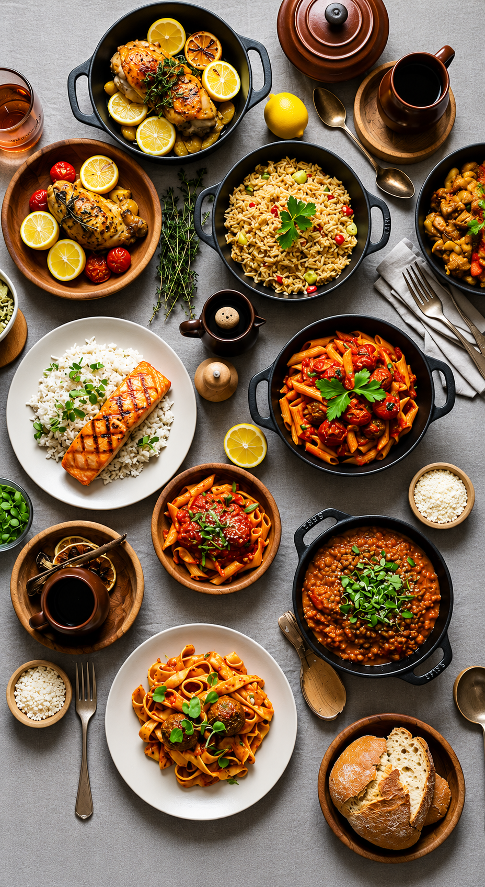
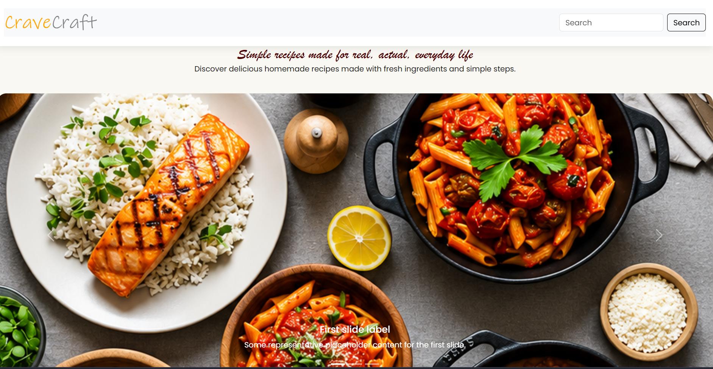
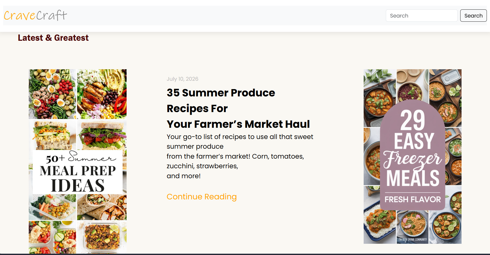
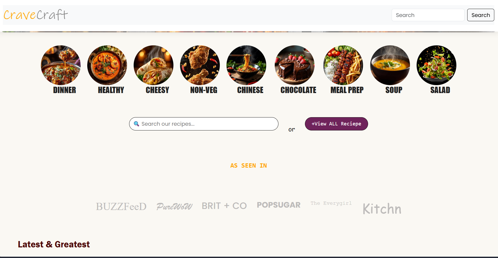
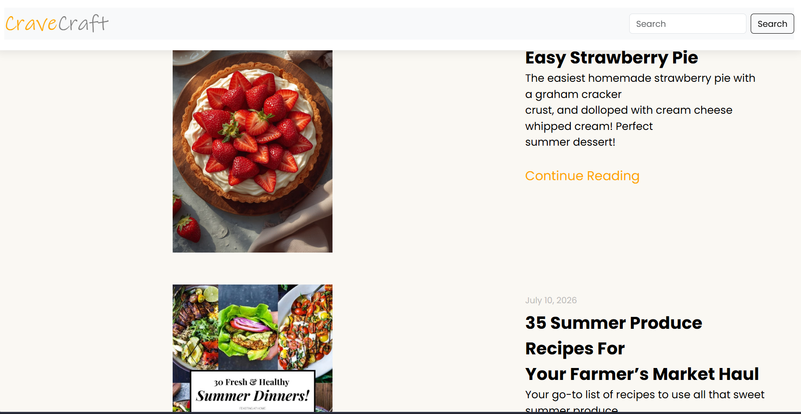
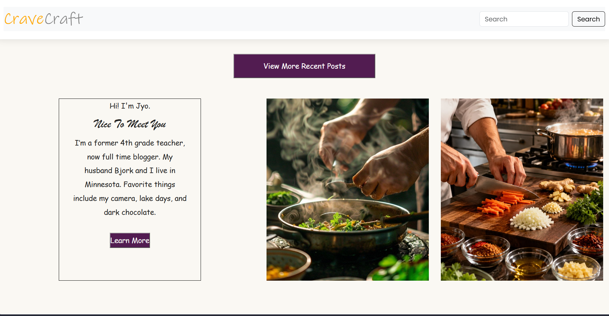
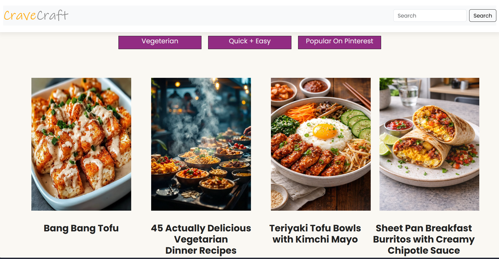
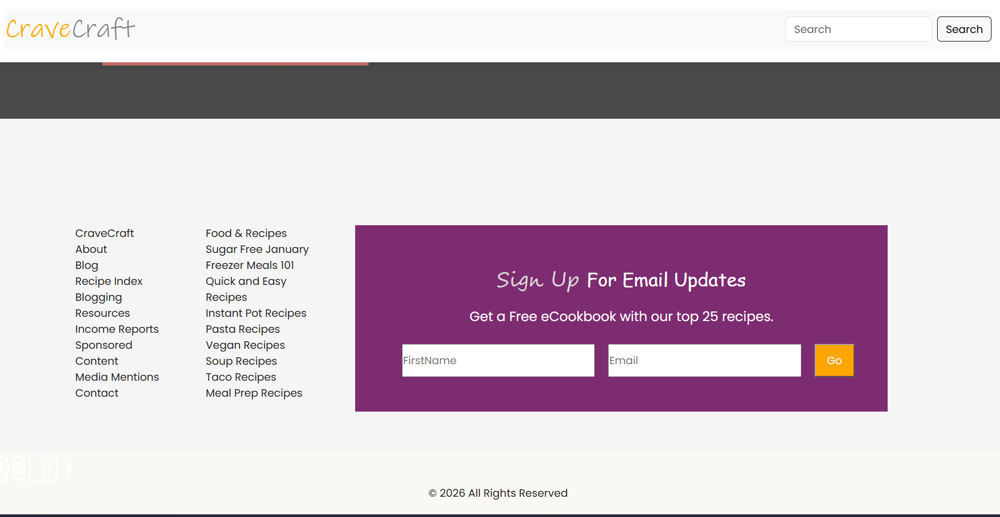
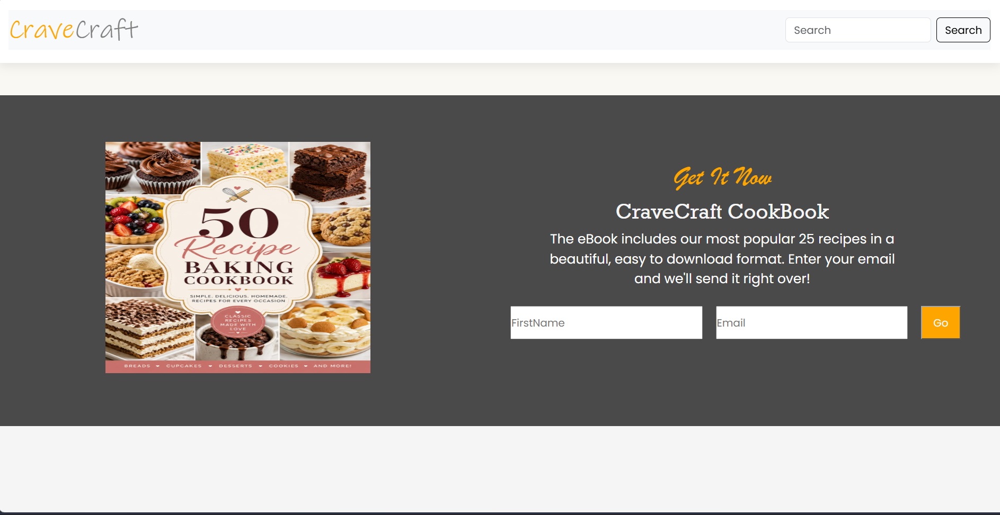

<p align="center">
  
</p>

<h1 align="center">🍴 CraveCraft</h1>
<h3 align="center">✨ A colorful, modern and responsive food & recipe website ✨</h3>

<p align="center">
  <a href="https://github.com/gayathrikrishnacodes/food">
    
  </a>
  
  
  
</p>

---

## 🌈 About CraveCraft

CraveCraft is a colorful food and recipe website designed to make food discovery simple, enjoyable, and visually engaging.

The site brings together recipe categories, featured food ideas, cooking inspiration, an About section, a recipe eBook area, and a newsletter section in one modern, responsive interface.

This project was built as a Frontend Web Development project to practice real-world HTML and CSS concepts — responsive layouts, Flexbox, CSS Grid, cards, forms, images, typography, hover effects, and reusable styling.

---

## 🍕 Features

| Feature | Description |
|---|---|
| 🏠 Hero Section | Attractive food-focused landing section with CTA buttons and statistics |
| 🍽️ Categories | Dinner, Healthy, Cheesy, Non-Veg, Chinese, Chocolate, Meal Prep and Soup |
| 🔎 Search UI | Dedicated recipe search interface |
| ⭐ Featured Recipes | Popular and trending recipe cards |
| 👩‍🍳 About | Introduction to the CraveCraft concept |
| 📌 Inspiration | Visual food inspiration gallery |
| 📕 Free eBook | Recipe eBook signup section |
| 📧 Newsletter | Email subscription interface |
| 🦶 Footer | Navigation, categories, social links and project information |
| 📱 Responsive | Desktop, tablet and mobile layouts |

---

## 🎨 Colorful Design

CraveCraft uses a warm, food-inspired palette:

| Color | Use |
|---|---|
| 🟠 Orange | Primary branding and actions |
| 🟡 Yellow | Highlights |
| 🩷 Pink | Sweet / colorful accents |
| 🟢 Green | Healthy food sections |
| 🟣 Purple | Category accents |
| 🔵 Teal | Fresh accents |
| 🤎 Dark Brown | Text and footer |
| 🤍 Cream | Main background |

**Typography**
- **Playfair Display** — headings
- **DM Sans** — body text and UI

---

## 🍽️ Recipe Categories

`🍝 Dinner` `🥗 Healthy` `🧀 Cheesy` `🍗 Non-Veg` `🥢 Chinese` `🍫 Chocolate` `🍱 Meal Prep` `🍲 Soup`

---

## 📱 Responsive Design

| Breakpoint | Layout |
|---|---|
| 🖥️ **Desktop** | Large hero layout, multi-column grids, full navigation, large food imagery |
| 💻 **Tablet** | Flexible grid layouts, adjusted spacing, responsive typography |
| 📱 **Mobile** | Mobile-friendly layouts, responsive images, flexible buttons & forms, two-column category cards, single-column recipe sections, no unintended horizontal overflow |

---

## 🛠️ Technologies Used

<p>
  
  
  
  
  
  
  
  
</p>

---

## 📂 Project Structure

```
Food/
│
├── .vscode/
├── index.html
├── style.css
├── README.md
│
├── dinner.png
├── healthy.png
├── quick.png
├── salad.png
│
├── img1.jpg ... img8.jpg
│
├── sum-img.jpg
├── staw.jpg
├── sum-dinner.jpg
├── cooking1.jpg
├── cooking2.jpg
├── bang.jpg
├── veg.jpg
├── kimchi.jpg
├── cheese.jpg
├── cookbook.jpg
├── freezer.jpg
│
├── fb.png
├── insta.png
├── twitter.png
├── wp.png
│
└── ss1.png ... ss8.png
```

---

## 🖼️ Screenshots

<p align="center">
  <b>🏠 Homepage</b><br>
  
</p>

<p align="center">
  <b>🍽️ Categories</b><br>
  
</p>

<p align="center">
  <b>⭐ Featured Recipes</b><br>
  
</p>

<p align="center">
  <b>👩‍🍳 About Section</b><br>
  
</p>

<p align="center">
  <b>📌 Food Inspiration</b><br>
  
</p>

<p align="center">
  <b>📕 Recipe eBook</b><br>
  
</p>

<p align="center">
  <b>📧 Newsletter</b><br>
  
</p>

<p align="center">
  <b>📱 Responsive Design</b><br>
  
</p>

---

## 🧠 Concepts Practiced

**HTML5** — semantic structure, navigation, sections, forms, images, links, buttons, alt text

**CSS3** — variables, Flexbox, CSS Grid, positioning, gradients, shadows, border radius, typography, hover effects, transitions, media queries

**Responsive layout flow:** Desktop → Tablet → Mobile

---

## 🚀 Getting Started

**1. Clone the repository**
```bash
git clone https://github.com/gayathrikrishnacodes/food.git
```

**2. Open the project**
```bash
cd food
```

**3. Open in VS Code**
```bash
code .
```

**4. Run the website**

This is a frontend-only project — no backend installation required. Open `index.html` directly in your browser, or use VS Code's Live Server extension.

---

## 🔗 Project Links

- 💻 **GitHub Repository:** [github.com/gayathrikrishnacodes/food](https://github.com/gayathrikrishnacodes/food)
- 🌐 **Live Demo:** *(add your deployed website URL here once deployed)*

---

## 📊 Project Highlights

| Area | Details |
|---|---|
| 🎨 Design | Colorful Food Blog UI |
| 📱 Responsive | Desktop + Tablet + Mobile |
| 🧱 Frontend | HTML5 + CSS3 |
| 📐 Layout | Flexbox + CSS Grid |
| 🖼️ Images | Food photography |
| ✨ Effects | Hover + transitions |
| 🔎 Search UI | Included |
| 📧 Forms | Newsletter + eBook |
| 🗂️ Categories | 8 food categories |
| 📸 Screenshots | 8 screenshots |
| 🔧 Backend | Not included |
| 🗄️ Database | Not included |

---

## 🔮 Future Improvements

This frontend can later be expanded into a complete full-stack food application:

- 🔍 Functional recipe search
- ❤️ Favorite recipes
- 👤 User authentication
- 📖 Individual recipe pages
- 📝 Add / edit / delete recipes
- 🛒 Shopping list
- ⭐ Ratings and reviews
- 💬 Comments
- 🌙 Dark mode
- 📧 Email notifications
- 📊 Admin dashboard
- 🗄️ MongoDB database
- ⚛️ React.js version
- 🔌 REST API

**Planned future architecture (MERN):**

```
React.js Frontend
        ↓
Express.js REST API
        ↓
Node.js Backend
        ↓
MongoDB Database
```

---

## 📚 What I Learned

Through this project, I practiced:

- Building a complete webpage from scratch
- Organizing HTML structure
- Creating reusable CSS
- Flexbox & CSS Grid layouts
- Responsive design & media queries
- Image positioning
- Card-based UI
- Forms
- Hover animations
- Typography
- Mobile-first thinking
- Git and GitHub workflow

---

## 🤝 Contributing

This is primarily a personal learning and portfolio project, but suggestions are welcome.

```bash
git clone https://github.com/gayathrikrishnacodes/food.git
cd food
git checkout -b feature/your-feature
git add .
git commit -m "Add your feature"
git push origin feature/your-feature
```

Then open a Pull Request.

---

## 👩‍💻 Author

**Gayathri Krishna**

🎓 BCA Graduate · 💻 Full Stack Developer · 🌐 Web Development Enthusiast

**Skills & Learning:** HTML · CSS · JavaScript · React.js · Node.js · Express.js · MongoDB · Git · GitHub

[](https://github.com/gayathrikrishnacodes)

---

## ⭐ Support

If you like this project:
- ⭐ Star the repository
- 🍴 Fork the repository
- 💬 Share your feedback

<p align="center">
  <b>🍕 CraveCraft</b><br>
  <i>Where every craving finds an idea. ❤️</i><br><br>
  Made with HTML, CSS & lots of food inspiration.
</p>
